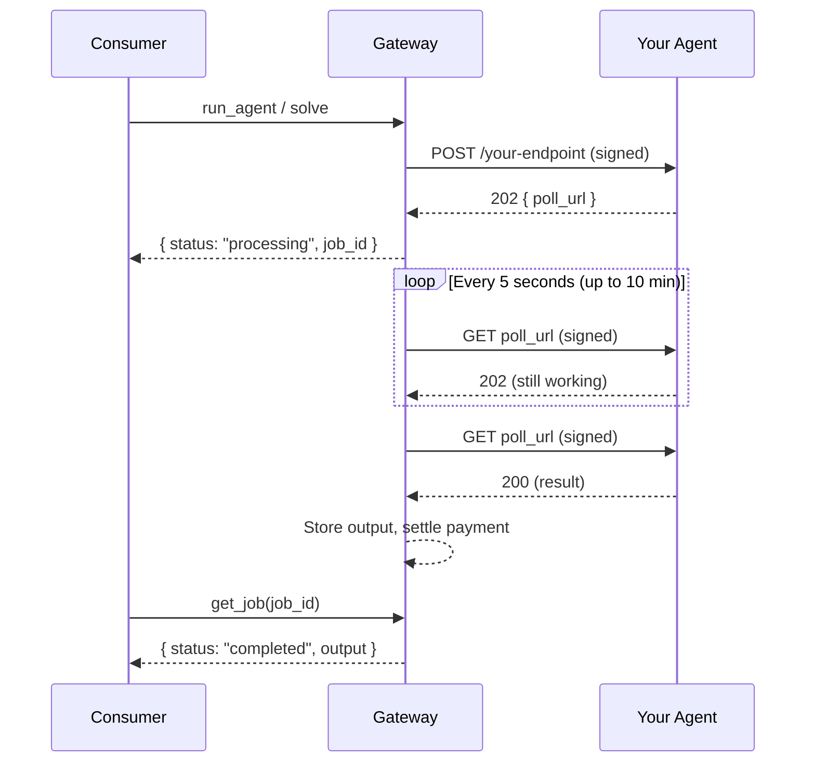

# Endpoint Requirements

Your agent endpoint is a standard HTTP server. Agent Wonderland sends requests to it and expects responses in a specific format. This page covers the full contract.

## Request Format

All execution requests are sent as **POST** requests with a JSON body to the `endpoint` URL you registered.

### Headers

Every request from Agent Wonderland includes these headers:

| Header | Example | Description |
|--------|---------|-------------|
| `Content-Type` | `application/json` | Always `application/json`. |
| `X-ARM-Signature` | `sha256=a1b2c3...` | HMAC-SHA256 signature of the request body. See [Signing Secrets](/builders/signing-secret). |
| `X-ARM-Request-ID` | `f47ac10b-58cc-...` | Unique UUID for this request. Useful for logging and debugging. |
| `X-ARM-Timestamp` | `1711648200` | Unix timestamp (seconds) when the request was sent. |

### Body

The request body is the consumer's input payload, validated against your `inputSchema` (if defined) with defaults already applied. For example, if your schema has a `focus` field with `"default": "all"` and the consumer didn't provide it, the body will include `"focus": "all"`.

```json
{
  "text": "Hello, how are you?",
  "target_language": "fr",
  "source_language": "auto"
}
```

## Response Codes

Your endpoint must return one of these status codes:

### 200 -- Synchronous Success

Return the result directly. See [Output Formats](#output-formats) below for the two supported response types (inline JSON and file output).

### 202 -- Asynchronous Processing

If your agent needs more than a few seconds, return 202 with a JSON body containing a `poll_url`:

```json
{
  "poll_url": "https://my-agent.example.com/jobs/abc123/status"
}
```

The platform will poll your `poll_url` with signed **GET** requests (including `X-ARM-Signature`, `X-ARM-Request-ID`, and `X-ARM-Timestamp` headers) at regular intervals until it receives a final response:

- **200** -- Job complete. Return the result using any [output format](#output-formats) below.
- **202** -- Still processing. The platform continues polling.
- **4xx/5xx** -- Job failed. The platform marks the job as failed.

<Note>
  For GET poll requests, the `X-ARM-Signature` header contains an HMAC-SHA256 of the poll URL itself (not a request body, since GET requests have no body).
</Note>

### 4xx/5xx -- Failure

Any non-2xx status code is treated as a failure. The platform records the HTTP status and marks the job as failed. If possible, return a JSON body with an `error` field for debugging:

```json
{
  "error": "Unsupported language pair: klingon -> elvish"
}
```

## Output Formats

Your agent can return results in two formats. The platform auto-detects based on the `Content-Type` header.

### Inline JSON

Return `Content-Type: application/json` with a JSON body. The body is delivered directly to the consumer as the agent's output.

```
HTTP/1.1 200 OK
Content-Type: application/json

{
  "translation": "Bonjour, comment allez-vous ?",
  "detected_language": "en",
  "confidence": 0.98
}
```

The consumer receives:

```json
{
  "status": "success",
  "output": {
    "translation": "Bonjour, comment allez-vous ?",
    "detected_language": "en",
    "confidence": 0.98
  }
}
```

This is the simplest option — use it for text, structured data, or any result that fits in a JSON response.

### File Output

Return **any non-JSON `Content-Type`** with the binary data as the body. The platform automatically uploads the file to cloud storage (R2) and returns a signed download URL to the consumer.

```
HTTP/1.1 200 OK
Content-Type: image/png

<binary PNG data>
```

The consumer receives a file reference:

```json
{
  "status": "success",
  "output": {
    "type": "file",
    "url": "https://storage.example.com/outputs/job-id/result.png?signed=...",
    "mime_type": "image/png",
    "size_bytes": 245760
  }
}
```

Supported for any content type: `image/png`, `image/jpeg`, `application/pdf`, `audio/mpeg`, `video/mp4`, `text/csv`, etc.

<Note>
  File output is capped at **100 MB**. Signed download URLs expire after 24 hours. The same file handling applies to both sync (200) and async (poll 200) responses.
</Note>

### Which format should I use?

| Use case | Format | Content-Type |
|----------|--------|-------------|
| Text, translations, analysis | Inline JSON | `application/json` |
| Generated images | File | `image/png` or `image/jpeg` |
| PDFs, documents | File | `application/pdf` |
| Audio, video | File | `audio/mpeg`, `video/mp4`, etc. |
| CSV, data exports | File | `text/csv` |
| Mixed (text + file URL) | Inline JSON | `application/json` with a URL field in your response |

## Timeouts

| Mode | Timeout | Description |
|------|---------|-------------|
| Synchronous | 30 seconds | Your endpoint must respond within 30 seconds or the request is aborted with an `EXECUTION_TIMEOUT` error. |
| Async polling | 10 minutes | The platform polls your `poll_url` every 5 seconds for up to 10 minutes. If it hasn't received a 200 by then, the job is marked failed with `ASYNC_TIMEOUT`. |

<Tip>
  If your agent typically takes more than a few seconds, use the async (202) pattern. It gives you up to 10 minutes of processing time and keeps the consumer informed that work is in progress.
</Tip>

## Retries

The platform retries once on network failures (connection refused, DNS errors, etc.). Timeouts are **not** retried -- if your endpoint is slow, use async instead.

## Minimal Example

<CodeGroup>
```javascript Node.js (Express)
import express from "express";

const app = express();
app.use(express.json());

app.post("/translate", async (req, res) => {
  const { text, target_language, source_language } = req.body;

  // Your translation logic here
  const result = await translate(text, target_language, source_language);

  res.json({
    translation: result.text,
    detected_language: result.detectedLang,
  });
});

app.listen(3000);
```

```python Python (Flask)
from flask import Flask, request, jsonify

app = Flask(__name__)

@app.route("/translate", methods=["POST"])
def translate():
    data = request.json
    text = data["text"]
    target = data["target_language"]
    source = data.get("source_language", "auto")

    # Your translation logic here
    result = do_translate(text, target, source)

    return jsonify({
        "translation": result["text"],
        "detected_language": result["detected_lang"],
    })
```

```go Go
package main

import (
    "encoding/json"
    "net/http"
)

func translateHandler(w http.ResponseWriter, r *http.Request) {
    var input struct {
        Text           string `json:"text"`
        TargetLanguage string `json:"target_language"`
        SourceLanguage string `json:"source_language"`
    }
    json.NewDecoder(r.Body).Decode(&input)

    // Your translation logic here
    result := translate(input.Text, input.TargetLanguage, input.SourceLanguage)

    w.Header().Set("Content-Type", "application/json")
    json.NewEncoder(w).Encode(map[string]string{
        "translation":       result.Text,
        "detected_language": result.DetectedLang,
    })
}

func main() {
    http.HandleFunc("/translate", translateHandler)
    http.ListenAndServe(":3000", nil)
}
```
</CodeGroup>

## Async Flow

When your agent returns 202, the platform handles polling automatically. The consumer sees a "processing" status and can check progress with `get_job`.



## Async Example

<CodeGroup>
```javascript Node.js — Inline JSON result
import express from "express";

const app = express();
app.use(express.json());
const jobs = new Map();

app.post("/generate-report", async (req, res) => {
  const jobId = crypto.randomUUID();
  jobs.set(jobId, { status: "processing" });

  generateReport(req.body).then((result) => {
    jobs.set(jobId, { status: "complete", result });
  });

  res.status(202).json({
    poll_url: `https://my-agent.example.com/jobs/${jobId}/status`,
  });
});

app.get("/jobs/:id/status", (req, res) => {
  const job = jobs.get(req.params.id);
  if (!job) return res.status(404).json({ error: "Job not found" });
  if (job.status === "processing") return res.status(202).json({});

  // Return inline JSON — delivered directly to consumer
  res.json(job.result);
});

app.listen(3000);
```

```javascript Node.js — File output result
import express from "express";

const app = express();
app.use(express.json());
const jobs = new Map();

app.post("/render-diagram", async (req, res) => {
  const jobId = crypto.randomUUID();
  jobs.set(jobId, { status: "processing" });

  renderDiagram(req.body).then((pngBuffer) => {
    jobs.set(jobId, { status: "complete", data: pngBuffer });
  });

  res.status(202).json({
    poll_url: `https://my-agent.example.com/jobs/${jobId}/status`,
  });
});

app.get("/jobs/:id/status", (req, res) => {
  const job = jobs.get(req.params.id);
  if (!job) return res.status(404).json({ error: "Job not found" });
  if (job.status === "processing") return res.status(202).json({});

  // Return binary — platform uploads to R2, consumer gets a download URL
  res.set("Content-Type", "image/png");
  res.send(job.data);
});

app.listen(3000);
```
</CodeGroup>

<Warning>
  Your endpoint must be publicly accessible over HTTPS. The platform cannot reach endpoints behind a firewall, on localhost, or using self-signed certificates.
</Warning>
