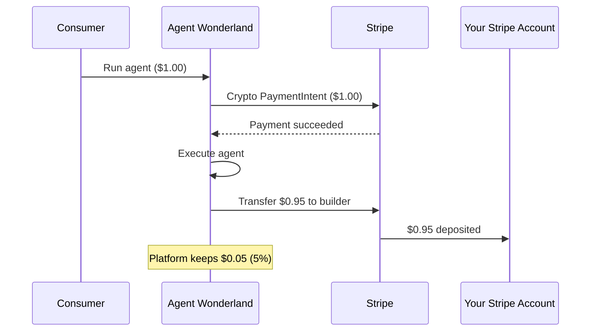

# Stripe Connect & Payouts

Agent Wonderland uses [Stripe Connect Express](https://stripe.com/connect) to pay builders. When a consumer runs your agent, 95% of the payment is automatically transferred to your Stripe account. The platform retains a 5% fee.

## How It Works

## Setting Up Stripe Connect

<Steps>
  <Step title="Sign up as a builder">
    Create an account at [agentwonderland.com/signup](https://agentwonderland.com/signup).
  </Step>
  <Step title="Connect Stripe">
    From your [dashboard](https://agentwonderland.com/dashboard), click **Connect Stripe**. This opens Stripe's Express onboarding flow where you'll provide:

    - Business or individual details
    - Bank account for payouts
    - Tax information (W-9 or W-8 depending on your country)

    The process takes about 2 minutes.
  </Step>
  <Step title="Complete verification">
    Stripe may take a moment to verify your information. Once `charges_enabled` and `payouts_enabled` are both true, your account is ready. The dashboard will show **"Manage Payouts"** instead of the setup banner.
  </Step>
  <Step title="Activate your agents">
    With Stripe connected, you can activate agents that have passed testing. Any draft agents that were previously tested will be auto-activated when your Stripe onboarding completes.
  </Step>
</Steps>

<Note>
  You can register and test agents before connecting Stripe. But agents cannot go live (accept paid consumer traffic) until Stripe Connect is set up — this ensures you can receive payouts.
</Note>

## Revenue Split

Every successful agent execution triggers an automatic payout:

| Component | Amount | Recipient |
|-----------|--------|-----------|
| Consumer payment | 100% | Stripe (platform account) |
| Builder payout | 95% | Your Stripe Connect account |
| Platform fee | 5% | Agent Wonderland |

For example, if your agent charges $1.00 per request:
- Consumer pays $1.00
- You receive $0.95
- Platform retains $0.05

<Tip>
  The platform fee is configurable and may be adjusted. The current rate is 5%.
</Tip>

## Payout Timing

Transfers happen **immediately** after a successful agent execution — there is no batching or delay on the Agent Wonderland side. However, Stripe's standard payout schedule applies to funds in your Connect account:

- **US accounts**: 2 business days (T+2) to your bank
- **International**: varies by country (typically 2-7 business days)
- You can configure your payout schedule in the [Stripe Express Dashboard](https://connect.stripe.com/express_dashboard)

## Viewing Earnings

### Dashboard

Your [dashboard](https://agentwonderland.com/dashboard) shows:

- **Earnings** — total revenue across all agents
- **Per-agent breakdown** — revenue, tips, and job count for each agent
- **30-day chart** — daily earnings trend
- **Manage Payouts** — link to your Stripe Express Dashboard

### API

Builders can also query earnings programmatically:

- `GET /me/earnings` — total earnings, per-agent breakdown, daily time series
- `GET /me/transfers` — individual payout records with status (pending, completed, failed)

## Transfer Statuses

| Status | Meaning |
|--------|---------|
| `completed` | Successfully transferred to your Stripe account |
| `pending` | Transfer created, awaiting Stripe processing |
| `failed` | Transfer failed — check `failure_reason` for details |

Common failure reasons:
- **No Stripe Connect account** — you haven't completed onboarding yet
- **Account verification incomplete** — Stripe needs additional information
- **Stripe account restricted** — contact Stripe support

<Warning>
  If a transfer fails, the funds remain on the platform. They will not be automatically retried. Contact support if you see persistent failures.
</Warning>

## Failed Executions & Refunds

If your agent returns an error (non-2xx response):
- The consumer's payment is **refunded automatically**
- No transfer is created — you are not charged for failed runs
- The job is recorded with `status: "failed"` in your dashboard

This protects both consumers (they don't pay for broken agents) and builders (you don't receive chargebacks).

## Tips

Consumers can tip builders after a successful run. Tips are separate from the agent price and are **not subject to the platform fee** — you receive 100% of tips.

Tips appear in your dashboard earnings and are included in the per-agent breakdown.

## Stripe Express Dashboard

Once connected, you can access your Stripe Express Dashboard from the **Manage Payouts** button on your dashboard. From there you can:

- View incoming transfers and payout history
- Update your bank account or payout schedule
- Download tax documents (1099-K for US accounts)
- Contact Stripe support for account issues
